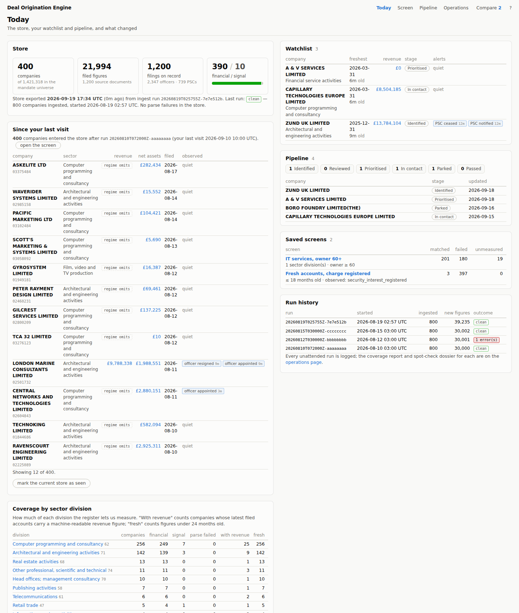
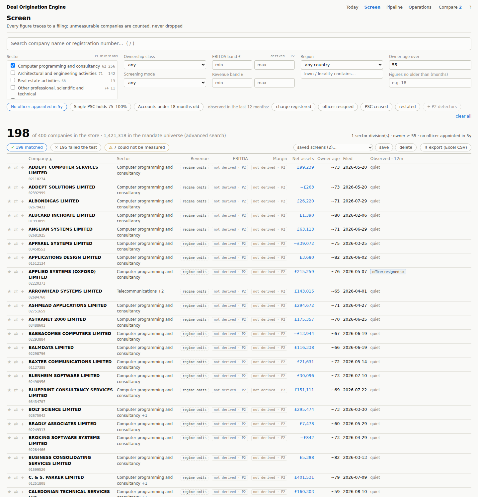
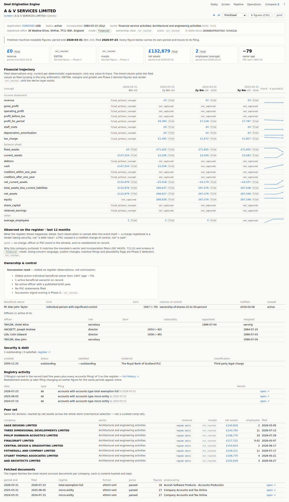
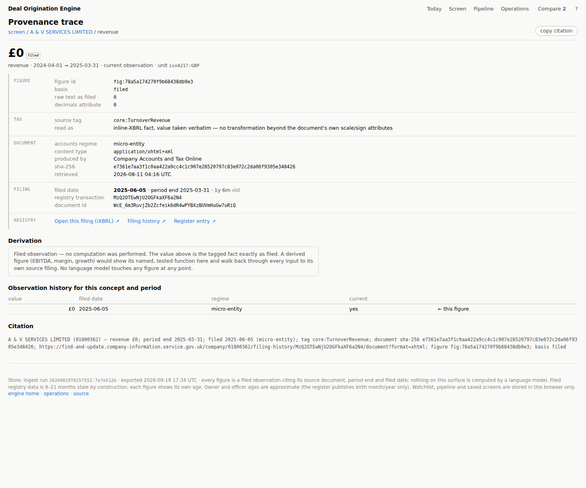
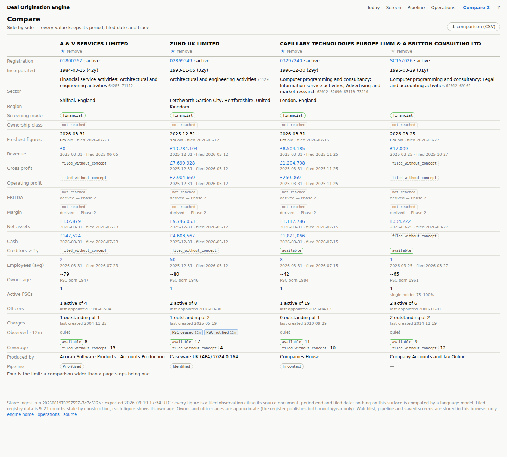
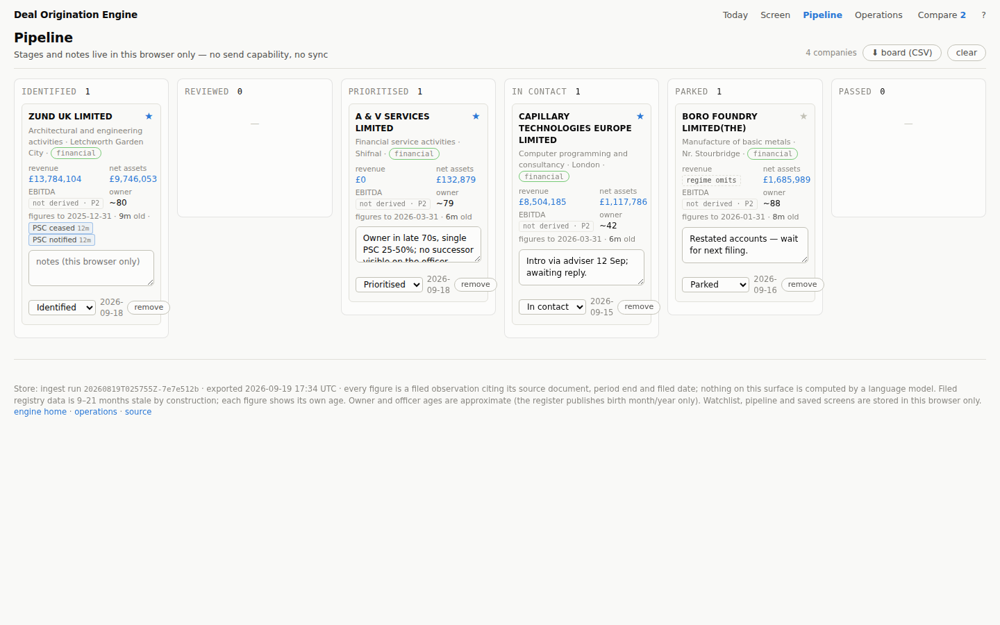
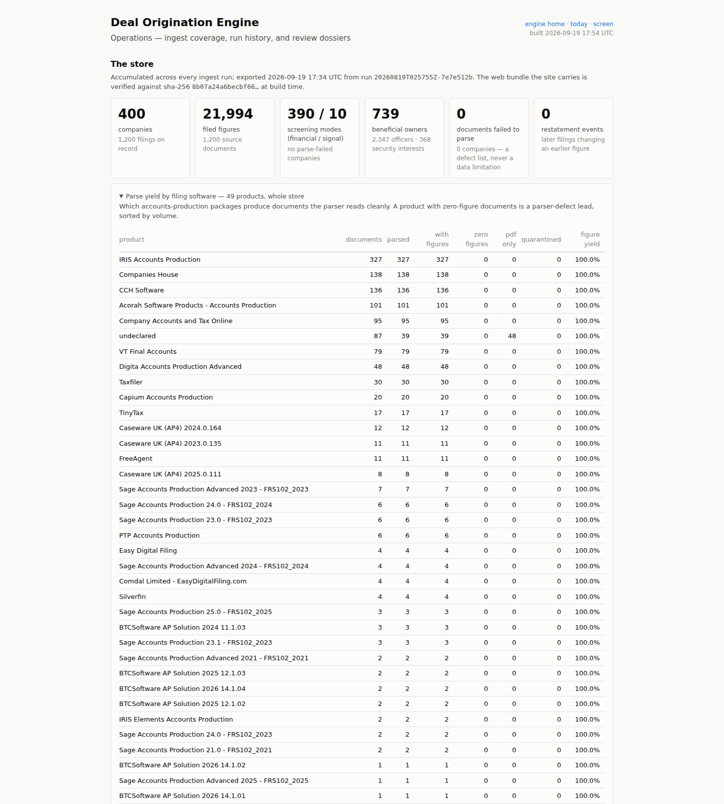

# Deal Origination Engine

A UK lower-mid-market origination screening engine built on Companies
House filings, where **every figure traces to a filed document**. It
enumerates a mandate's universe from the public register, ingests each
company's filings, parses inline-XBRL accounts into figures that carry
their provenance, and serves an analyst-facing product — screen, company
deep dive, compare, pipeline, provenance trace — over the whole store.

The language model reads figures and writes prose; it never computes or
stores a number. That is enforced in code and tests, not in prompts.

| | |
|---|---|
| Live site | `https://deal-origination-alpha.vercel.app` — landing, `/app/today.html`, `/app/screen.html`, `/ops/` |
| Store | rolling GitHub release `data-store` (SQLite + web bundle), grown nightly by `ingest.yml` |
| Stack | Python 3.11 (Pydantic v2, SQLAlchemy 2.0, httpx, ixbrlparse, Typer); static site with a zero-dependency Node build; GitHub Actions; Vercel |

## What it does, end to end

```
mandate YAML ─► universe enumeration ─► per-company ingest ─► iXBRL parse ─► figures + coverage facts
                (advanced search,       (profile, officers,    (concept map,   (basis: filed;
                 SIC patterns)           PSCs, charges,         namespaces,     source doc, tag,
                                         filing history,        per-product     period, filed date)
                                         accounts documents)    telemetry)
                                                │
                       nightly, accumulating ◄──┘──► coverage report · spot-check dossier · run log
                                                │
                                web data bundle (index + bucketed records) ─► static site
```

1. **Mandate** (`mandates/*.yaml`): sectors as SIC patterns, geography,
   size metrics, rubric dimensions with the screening mode each requires.
   Validated against jurisdiction profiles and adapter capability matrices
   before anything runs.
2. **Ingest** (`deal-engine ingest`): enumerates the universe, triages each
   company (status, sector, dormancy), fetches its register surface and its
   three most recent accounts documents, parses what is machine-readable,
   records a **coverage fact with a cause** for every concept it could not
   read, and derives the company's **screening mode** — `financial` where
   filed statements are machine-readable, `signal` where only observable
   behaviour is. Per-company errors are isolated and retried on the next run.
3. **Store**: SQLite, constraints own the invariants (a filed figure without
   a source document cannot be written; the same observation twice is one
   row; a later filing supersedes deterministically and the earlier
   observation stays on the record as a restatement).
4. **Product**: `scripts/export_web_data.py` projects the store into a
   per-company index and bucketed full records; the site build downloads
   the bundle from the release, verifies its sha-256 against the committed
   manifest, and serves it statically. Nothing financial is computed in the
   browser.

## The product surface

Screenshots are from a local build over a 400-company export of the
store (real register data, no samples), with browser-local state seeded
so the watchlist, pipeline and saved screens have content.

**Today** — the store's shape, what entered it since this browser last
looked (by ingest run id), the watchlist with staleness and register
events, the pipeline at a glance, saved screens with live counts, coverage
by sector division, run history.



**Screen** — the thesis builder. Sector, ownership class, EBITDA and revenue
bands, region, owner age, "no officer appointed in five years", single-PSC
control, staleness cutoff, screening mode, and observed-event chips. The
count always breaks three ways — **matched / failed the test / could not be
measured** — and the third number is clickable, never hidden: a filter over
a concept the register cannot supply for a company does not silently drop
it. Sort on any column, star to watch, ⇄ to compare, + to the pipeline,
save the screen (it is a query string), export to Excel with a source
column beside every figure column.



**Company** — filed trajectory with trend sparklines (values plotted as
filed; scaling is the only arithmetic), what was observed on the register
in the last twelve months, ownership and control stated as observations,
security interests, the registry activity timeline, restatements, a peer
set, fetched documents, and per-concept coverage with its recorded cause.



**Trace** — one figure walked back to the register: figure → inline-XBRL
tag → source document (regime, producing software, sha-256) → filing date
and transaction → the filing itself on Companies House, with a copyable
citation. A derived figure would show its named, tested function and walk
through every input; a filed figure states that no computation was
performed.



**Compare** (up to four, each value keeping its period, filed date and
trace), **Pipeline** (a browser-local board — stages and notes for the
analyst's own working state; no send capability by design), and
**Operations** (every run's coverage report, parse yield by filing
software, parse failures as a standing defect list, spot-check dossiers).





## The invariants

These are enforced in code and tests (see `tests/`), and the product
surface is built to make them visible rather than to hide their cost.

1. **The language model never computes a financial figure.** Every stored
   figure has a basis — `filed` (verbatim from a source document, tag and
   location recorded), `derived` (named, tested Python function; input
   figure ids recorded) or `modelled`. Prose cites figures with `{fig:ID}`
   markers and the renderer substitutes values; a bare financial numeral
   in rendered output fails the render.
2. **Provenance is mandatory and transitive.** Pydantic validators and DB
   CHECK constraints refuse a filed figure without a source document;
   `provenance_walk` resolves any figure to its documents and detects cycles.
3. **Figures are observations.** The same (company, concept, period) from
   different filings coexists; `is_current` is deterministic (latest filed
   date wins); re-ingest is idempotent — zero new rows, zero flag changes.
4. **Aggregators are not sources.** Aggregator-derived numbers carry basis
   `unverified` and never render.
5. **Every unattended run is logged**, and — recorded after the September
   post-mortem — **persists before failing**: the night's verified progress
   is saved before any error is reported.
6. **Ownership fails closed.** Absence of a PSC statement is not evidence of
   independence; unclassifiable ownership is flagged, never passed.
7. **Signals are named after what is observed**, not what is inferred:
   `security_interest_registered`, not "recent debt raise"; `psc_ceased`,
   not "a sale".
8. **Core is jurisdiction-generic.** Registry vocabulary lives in the
   adapter; a leakage-guard test fails on any jurisdiction-specific token
   in core.
9. **Screening mode is per company**, and a composite over partial
   dimensions is marked renormalised — a partial score never renders as
   complete.

### Absence carries a cause

Most UK small companies file no public P&L, and the register offers many
filings only as PDF. The engine never collapses a gap into a dash. Five
states are kept distinct everywhere they appear:

| state | meaning |
|---|---|
| `filed_without_concept` | the accounts regime legitimately omits the concept (micro-entity accounts carry no P&L) |
| `unparseable_format` | a filing exists but has no machine-readable rendition |
| `parse_failed` | a machine-readable document failed to parse — a system defect, listed on the operations page, never a data limitation |
| `not_reached` | a Phase 2 computation (EBITDA, margins, growth, scores, ownership class, detectors) that has not run |
| `not_captured` | outside the fetched window |

### Staleness is shown, never hidden

Filed registry data is 9–21 months old by construction. Every figure shows
its period end and filed date; profiles lead with the freshest
machine-readable period; anything over 24 months is marked stale. Profiles
state *"no public evidence of a current or recent sale process as of
{date}"* with a dated evidence list — never that a company is "not being
marketed", which no public registry can evidence.

## Data reality, and what is deliberately not built

- EBITDA screening is two-stage by design: filed P&L where it exists,
  balance-sheet and employee proxies elsewhere, `insufficient_data` as a
  first-class outcome. Derived figures are Phase 2 and render
  `not_reached` until the tested derive layer exists — nothing is
  approximated in the meantime.
- The coverage report (by SIC code, within the mandate's universe) and the
  parse yield by filing software are standing outputs of every ingest. The
  per-product telemetry is how the Digita per-element-namespace parser
  defect was found and fixed, with a golden fixture.
- Not built, on purpose: automated outreach or any send capability,
  ToS-violating scrapers, "total pipeline value" metrics, multiple API keys
  to evade rate limits, dashboards ahead of verified data, any LLM
  arithmetic.

## Operations

- **Nightly ingest** (`.github/workflows/ingest.yml`, 02:00 UTC): seeds the
  store from the rolling release, ingests up to 800 new companies (the
  checkpoint skips stored ones before any API call), uploads the grown
  store and the web bundle back to the release, commits the run's reports
  and the bundle manifest — which triggers the site redeploy. Per-company
  errors make the run red *after* progress is persisted.
- **Publish web data** (`publish-web-data.yml`): rebuilds the bundle from
  the current store without ingesting — for frontend releases.
- **Gate** (`ci.yml`): tests, mandate validation gates, the golden filing
  eval, and a dependency-free site build in empty state.
- **Guard hook** (`.claude/hooks/guard.py`): denies network calls outside
  the Companies House allowlist and anything touching credential files
  during agent-assisted development. It pattern-matches tool arguments; it
  is a guardrail, not an egress sandbox.

## Running it

```bash
pip install -e ".[dev]"
pytest                                             # unit, integration, golden eval
deal-engine mandate validate mandates/example-lmm-gb.yaml
CH_API_KEY=… deal-engine ingest --mandate mandates/example-lmm-gb.yaml --limit 50 --db data/engine.db --data data
python scripts/export_web_data.py data/engine.db --out web/data/local
node web/build.mjs && python -m http.server 8123 --directory web/dist   # http://127.0.0.1:8123/
```

The site is fetched, not inlined: serve `web/dist/` over HTTP. With a
bundle at `web/data/local/` the build uses it directly; otherwise it
downloads the bundle named by `web/data/manifest.json` and verifies it.

## Layout

```
mandates/                 mandate YAMLs (nothing about a mandate is hardcoded)
jurisdictions/            jurisdiction profiles (facts as configuration)
src/deal_engine/
  concepts.py             canonical concept registry
  models/                 Pydantic v2 domain models (validation at boundaries)
  db/                     SQLAlchemy 2.0 schema; constraints own the invariants
  adapters/companies_house/  client, universe enumeration, mapping, pipeline, concept map
  parse/                  inline-XBRL parsing (document-wide namespace fallback)
  mandate/                YAML loader + ERROR/WARNING validator
  derive/, signals/       declarations (implementations: Phase 2)
  render/                 {fig:ID} marker validation and substitution
  cli.py                  Typer CLI; runlog.py per-run JSONL logging
scripts/                  export_web_data.py, spot_check.py, seed_checkpoint.py, record_fixtures.py
web/                      build.mjs; src/landing, src/app (product), src/ops; data/manifest.json
artifacts/ingest/<run>/   committed coverage reports, spot-check dossiers, run logs
evals/golden/             hand-verified filings and company surfaces
tests/                    incl. the jurisdiction-leakage guard and the export projection
PLAN.md                   the plan and the decision record (§11: the post-mortem)
```
